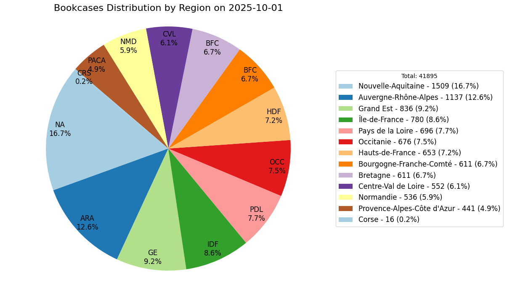

# bookcases-delivrez

**Data last updated on: 2025-08-01**

Public bookcases extracted from delivrez.fr




## ⚠️ DO NOT IMPORT INTO OPENSTREETMAP! ⚠️

Do not import directly in OSM. Verify each bookcase in person before adding it to OSM.

## How to Use the Data

Use the data to display bookcases in OsmAnd, JOSM, uMap, and more. Visit them in person and add or update them on OpenStreetMap.

### Using OsmAnd

**Note:** To avoid lag, do not use `bookcases.gpx` file. Instead, use the region-specific GPX files, such as `Bretagne.gpx`.

1. Open the `bookcases` folder for the latest data.
2. Download a region-specific GPX file (e.g., `Bretagne.gpx`).
3. Copy the GPX file to your device.
4. Open OsmAnd.
5. Go to Favorites.
6. Use the **+** (import) button.
7. Select the GPX file.
8. Bookcases are now displayed on the map.


### Using JOSM

1. Open the `bookcases` folder for the latest data.
2. Download the `bookcases.geojson` file.
3. Open JOSM.
4. Use the Open File button.
5. Select the `bookcases.geojson` file.
6. Bookcases are now displayed on the map.

## How to Update the Data

1. Install the necessary Python libraries:
    ```sh
    pip install beautifulsoup4 fake_useragent geojson matplotlib pandas selenium shapely
    ```
2. Run `1_fetch_bookcases.py` to fetch and create `bookcases.geojson`.
3. Run `2_filter_by_region.py` to split the bookcases into GeoJSON files for each French region.
4. Run `3_create_OsmAnd_gpx.py` to convert each GeoJSON file into an OsmAnd GPX file.

The script will create `geojson` files in the new folder.

- `bookcases.geojson` contains all bookcase
- `giveboxes.geojson` contains all give boxes
- `edibles.geojson` contains location of Incredible Edibles
- `seedboxes.geojson` contains location of sesboxes

You will find in folder `region` all POI filtered by region.

## About region files in asset folder

You can add your own 'regions' in the `asset/region` folder.
For example another country, etc.

To do so:

1. Create or find a shape (geojson or other)
1. Open your shape with JOSM
1. Select your shape in JOSM
1. In the menu, click on '**Create a multipolygon**'
1. Export your layer as `geojson` file

Note, if you use a geojson file as a region, you have to convert it as a multipolygon with this technique.
Otherwise GeoPandas will not be able to parse them correctly.
